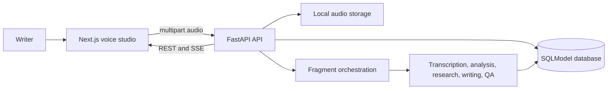

# Robo Blog Wiki

Robo Blog turns short, unordered voice fragments into a working blog draft. The application is split into a Next.js browser client and a FastAPI backend that persists blog state and coordinates AI-assisted processing.

## Wiki Pages

- [Frontend architecture](frontend.md): browser UI, recording lifecycle, state management, and API client.
- [Backend architecture](backend.md): FastAPI layers, persistence model, routes, agents, integrations, and events.
- [End-to-end workflow](end-to-end-workflow.md): request-by-request behavior from microphone to validated draft.

## System At A Glance

## Runtime Status

The checked-in application starts with a seeded `demo-blog`, SQLite, and filesystem audio storage. OpenAI and Tavily integrations activate only when their corresponding environment variables contain real credentials. R2 and Supabase settings are documented in [backend/.env.example](../../backend/.env.example), but their runtime adapters are not yet implemented.

## Related Design Documents

- [Product concept](../../ai_voice_to_blog.md)
- [Detailed implementation plan](../detailed_implementation_plan.md)