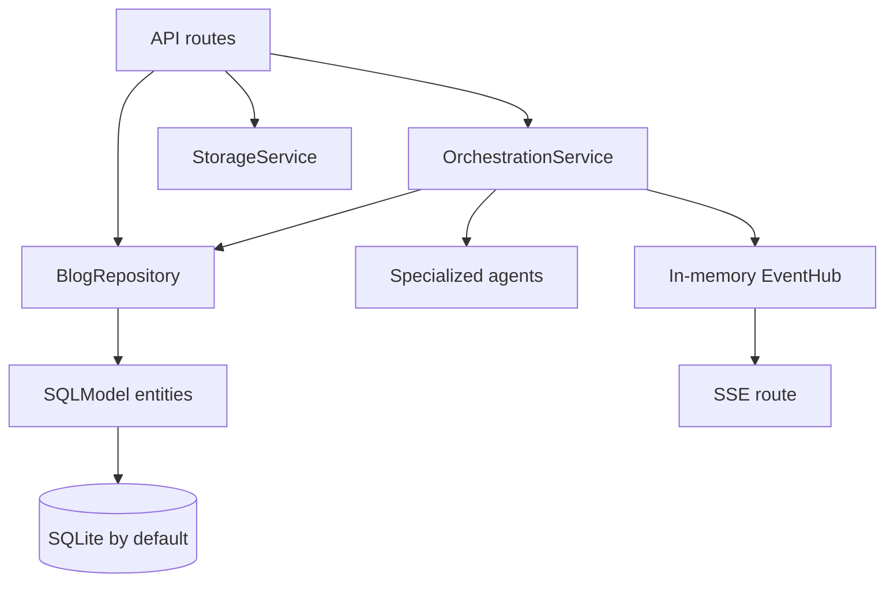

# Backend Architecture

## Layers

## Application Startup

[app/main.py](../../backend/app/main.py) builds the FastAPI app, adds CORS using `CORS_ORIGINS`, and registers routers for blogs, fragments, generation, drafts, and events. Its lifespan creates database tables and seeds `demo-blog`, a default guardrail, an empty Blog Brain snapshot, and a `blog.seeded` processing event.

[app/core/config.py](../../backend/app/core/config.py) loads [backend/.env](../../backend/.env) and exposes database, CORS, OpenAI, Tavily, R2, and Supabase settings. Placeholder values beginning with `replace-with-` are intentionally treated as absent credentials.

## For Node.js Developers

FastAPI occupies roughly the role of Express or NestJS, but it derives request validation, serialization, and OpenAPI metadata from Python type annotations. A route function is comparable to an Express handler; `APIRouter` is comparable to an Express router module; and application lifespan is analogous to startup/shutdown initialization performed before accepting requests.

| Python / FastAPI concept | Node.js analogy | How it is used here |
| --- | --- | --- |
| `FastAPI` + `APIRouter` | Express `app` + `Router` | [app/main.py](../../backend/app/main.py) registers route modules; [api/blogs.py](../../backend/app/api/blogs.py) owns blog endpoints. |
| Pydantic request/response models | Zod schemas used at route boundaries, or NestJS DTOs | [schemas/api.py](../../backend/app/schemas/api.py) validates data and maps Python snake case to JSON camel case. |
| `Depends` and `Annotated` | Express middleware/request-scoped dependency container | [core/deps.py](../../backend/app/core/deps.py) injects a SQLModel session and current user id into route handlers. |
| SQLModel `Session` | Unit-of-work ORM session, similar in purpose to a Prisma client request scope or TypeORM manager | One session is yielded per request, then passed through routes, services, and repository methods. |
| Repository | Data-access service / ORM adapter | [repositories/blog_repository.py](../../backend/app/repositories/blog_repository.py) owns query and persistence logic. |
| `async def` | An `async` Express handler | It permits `await`, but synchronous code inside it still blocks the event loop. |
| `RunnableLambda.invoke` | A direct synchronous service call | It invokes each agent inline; it is not a background worker or message queue. |
| SSE `StreamingResponse` / `EventSourceResponse` | Express response that stays open with `text/event-stream` | [api/events.py](../../backend/app/api/events.py) streams items from the in-process event hub. |

The pipeline's write model is intentionally append-oriented in two places. Every Blog Brain update creates a new snapshot version, and every generated or revised draft creates a new draft version. This resembles event-history/versioned records more than mutating one document in place. `ProcessingEvent` is a durable timeline table, while the `EventHub` is a separate transient delivery mechanism.

## API Surface

| Group | Routes | Purpose |
| --- | --- | --- |
| Blogs | `POST /blogs`, `GET /blogs/{id}` | Create and retrieve blog metadata. |
| Fragments | `POST /blogs/{id}/fragments`, `GET /blogs/{id}/fragments`, `POST /fragments/{id}/process` | Upload, list, and manually reprocess voice fragments. |
| State | `GET /blogs/{id}/state`, `GET /blogs/{id}/timeline` | Return Blog Brain cards and persisted processing events. |
| Research | `GET /blogs/{id}/research`, `POST /blogs/{id}/research/run` | Inspect and run the pending research queue. |
| Drafts | `POST /blogs/{id}/draft/generate`, `POST /drafts/{id}/validate`, `POST /drafts/{id}/revise` | Generate, validate, and revise versioned drafts. |
| Explainability | `GET /drafts/{id}/sources`, `GET /drafts/{id}/sentences/{sentenceId}/why` | Return blog sources and sentence explanation data. The sentence explanation response is currently a placeholder. |
| Events | `GET /blogs/{id}/events` | Server-Sent Events stream from the in-memory event hub. |

## Persistence

[models/entities.py](../../backend/app/models/entities.py) defines SQLModel tables. SQLite is the local default; the database engine and table initialization live in [core/database.py](../../backend/app/core/database.py).

| Area | Records |
| --- | --- |
| Blog identity | `User`, `Blog`, `Guardrail` |
| Fragment understanding | `Fragment`, `FragmentAnalysis`, `Claim`, `ResearchQuestion` |
| Evidence | `Source`, `Evidence` |
| Generated output | `BlogBrainSnapshot`, `Draft`, `QaResult` |
| Audit | `ProcessingEvent` |

[repositories/blog_repository.py](../../backend/app/repositories/blog_repository.py) is the persistence boundary. It saves immutable versions of Blog Brain snapshots and drafts by incrementing each blog's latest version. It also records claims, sources, evidence links, QA results, and event timeline entries.

## Agent Responsibilities

| Agent | Implemented behavior |
| --- | --- |
| [TranscriptionAgent](../../backend/app/agents/transcription_agent.py) | Uses an existing transcript hint when supplied. Otherwise, with `OPENAI_API_KEY`, reads local or URL-based audio and calls the configured OpenAI transcription model. Missing credentials, empty output, or provider errors return explicit non-completed statuses. |
| [FragmentAnalysisAgent](../../backend/app/agents/fragment_analysis_agent.py) | Uses a Pydantic structured LLM response when OpenAI is configured; otherwise extracts a summary, basic topics, claims, questions, experiences, sentiment, and intent with heuristics. |
| [BlogBrainStateAgent](../../backend/app/agents/blog_brain_state_agent.py) | Merges the latest analysis into thesis, arguments, open questions, contradictions, guardrails, and a compact provenance map. Each merge is persisted as a new snapshot. |
| [ResearchPlannerAgent](../../backend/app/agents/research_planner_agent.py) | Produces deduplicated factual-research questions, priorities, deep-research flags, and human-review flags. Its fallback derives questions only from claims marked `requires_research`. |
| [ResearchAgent](../../backend/app/agents/research_agent.py) | Queries Tavily when configured, normalizes source metadata, assigns domain-based credibility, and extracts bounded evidence snippets. Without usable evidence it returns `insufficient_evidence`; it never synthesizes a fake source. |
| [WritingAgent](../../backend/app/agents/writing_agent.py) | Calls a structured LLM draft prompt when configured, selecting the stronger model for strong research. The fallback builds a Markdown draft with thesis, key points, and actual sources. |
| [QaGuardrailsAgent](../../backend/app/agents/qa_guardrails_agent.py) | Calls a structured LLM quality review when configured. The fallback checks citation requirements, contradictions, and banned topics, then records publish blocking state. |

## External Integrations

| Integration | Configuration | Active behavior |
| --- | --- | --- |
| OpenAI | `OPENAI_API_KEY`, model variables | Transcription and LangChain structured prompts activate with a real key. |
| Tavily | `TAVILY_API_KEY` | Research search activates with a real key. |
| Audio storage | `AUDIO_STORAGE_DIR` | Active local filesystem storage. R2 variables are configured but no R2 adapter exists yet. |
| Database | `DATABASE_URL` | SQLite works locally. PostgreSQL is configurable, but pgvector support is not implemented. |
| Supabase | `SUPABASE_*` | Settings exist; authentication and user isolation are not implemented. |

## Events And Reliability

[core/events.py](../../backend/app/core/events.py) provides a process-local async queue per blog for SSE. [OrchestrationService](../../backend/app/services/orchestration_service.py) records durable `ProcessingEvent` entries and publishes `fragment_processed`, `draft_updated`, research completion, or processing failure events.

The workflow is synchronous within the upload request: it uses `RunnableLambda.invoke` around each agent rather than a background worker or a compiled LangGraph. It has an explicit stop condition for transcription failures, but does not yet provide idempotency keys, retry backoff, durable queues, dead-letter handling, or cross-process event replay.

## Caveats

- The default user dependency always returns `DEFAULT_USER_ID`. There is no token verification, ownership check, or row-level access control, so this must not be treated as a multi-user deployment.
- Audio upload waits for transcription, analysis, research, writing, and QA before returning. The route is declared `async`, but its synchronous agent calls can block request handling under load.
- Audio is stored locally and its duration is estimated from byte length. R2 configuration exists but has no storage adapter, and the estimate is not reliable audio metadata.
- SQLite and the in-memory `EventHub` suit local development. Multiple backend processes would not share active SSE subscribers; restarting the process loses in-memory events.
- The research workflow marks pending claims and questions complete even when the research agent returns `insufficient_evidence`. Consumers should inspect research result quality rather than treating `completed` as proof.
- The database model does not enforce foreign keys or idempotency keys. Reprocessing a fragment can therefore create repeated analyses, claims, sources, evidence, and draft versions.
- The sentence `why` endpoint returns fixed explanatory data rather than resolving the draft's actual provenance map and evidence records.
- Revision currently appends the user's request to the draft instead of invoking a targeted rewrite. Publish status is not implemented.