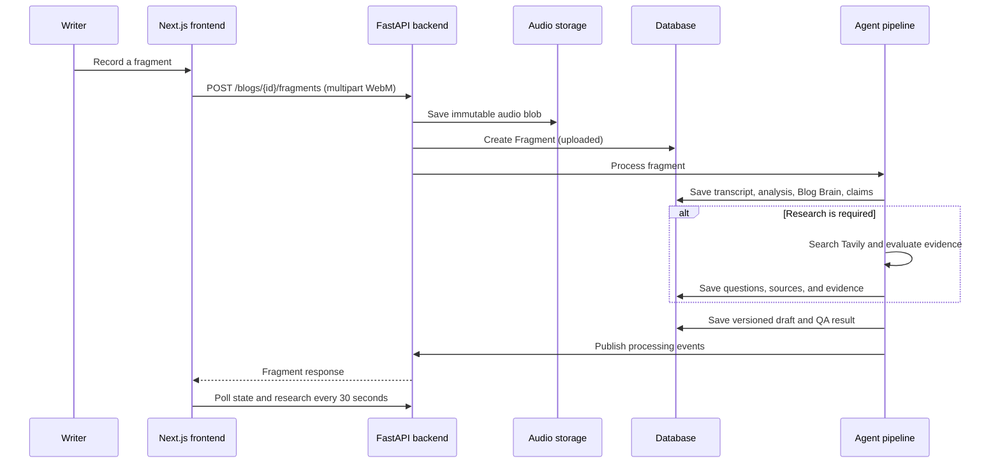
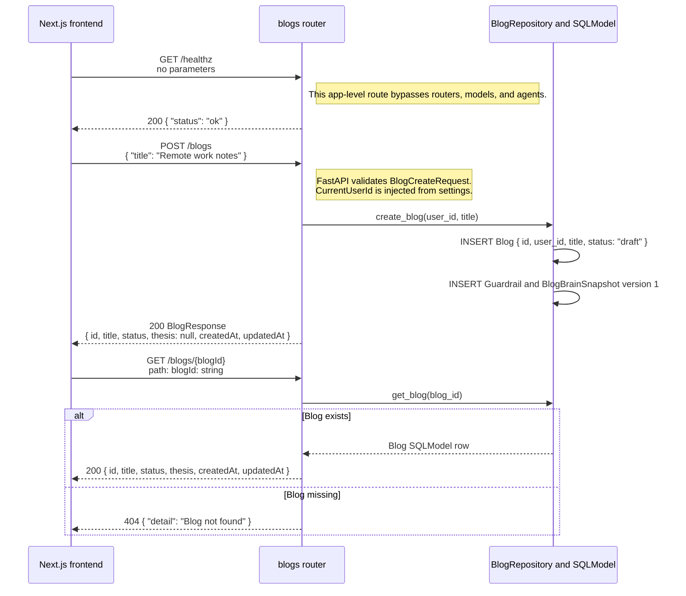
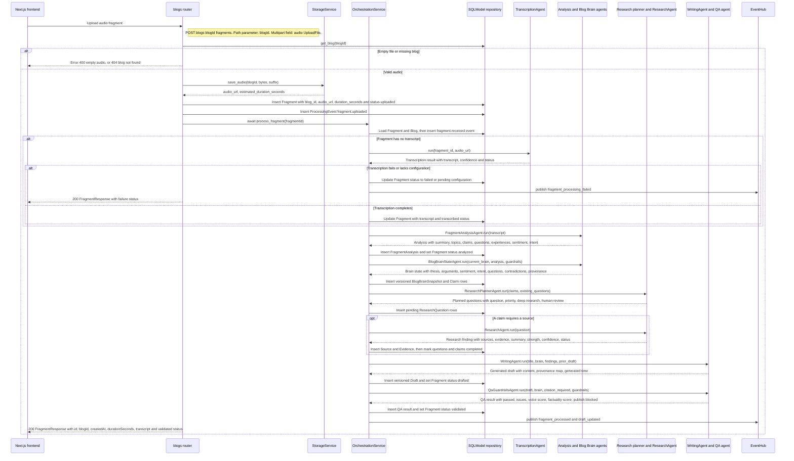
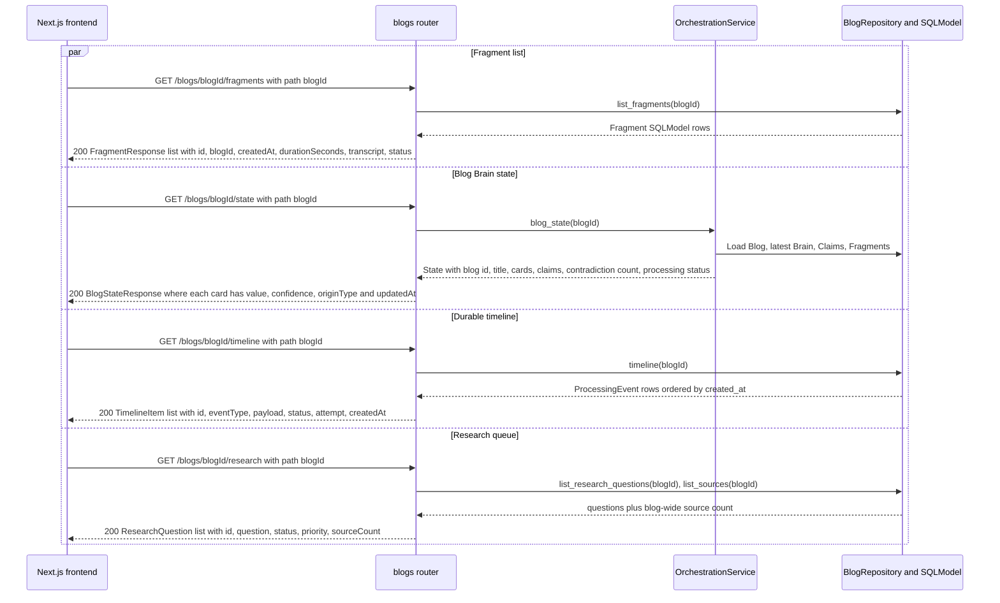
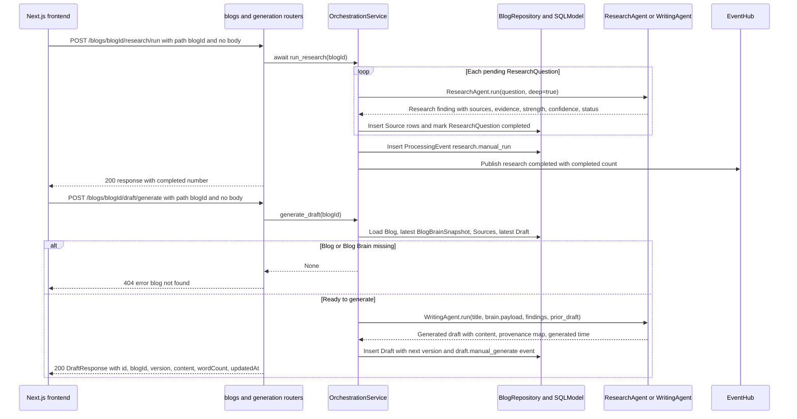
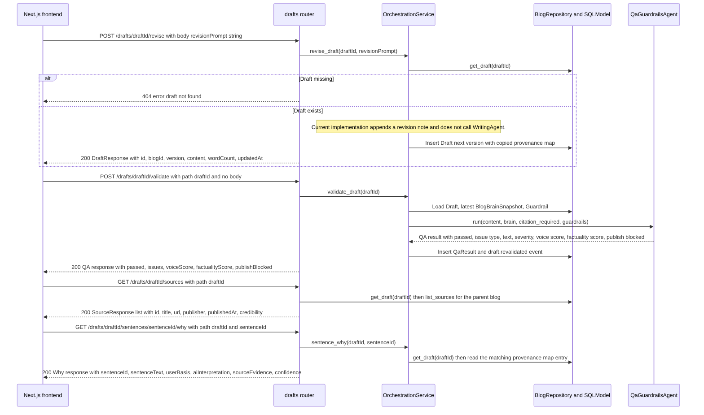
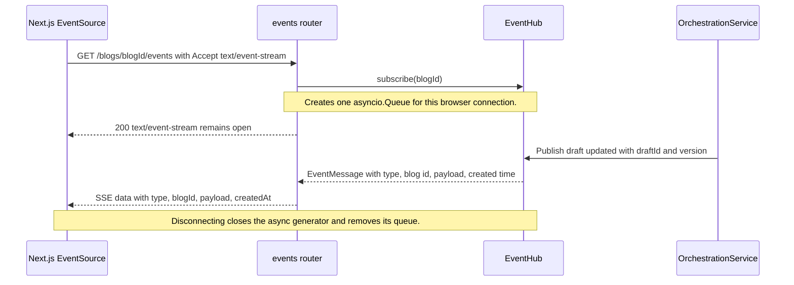

# End-to-End Workflow

## Fragment To Draft

## Blog Creation And Lookup

## Upload And Full Fragment Processing

## Blog Read Models

## Manual Research And Draft Generation

## Draft Review Interactions

## Live Event Interaction

## Detailed Server Processing

The upload route in [backend/app/api/blogs.py](../../backend/app/api/blogs.py) accepts an audio file, rejects an empty payload, saves it through `StorageService`, creates a `Fragment`, adds `fragment.uploaded` to the event timeline, then awaits `OrchestrationService.process_fragment`.

1. **Receive**: The service loads the fragment and blog and persists `fragment.received`.
2. **Transcribe**: If the fragment has no transcript, the transcription agent runs. A non-`completed` result sets the fragment to `pending_configuration` or `transcription_failed`, records `fragment.transcription_failed`, emits an SSE failure event, and stops the workflow.
3. **Analyze**: The fragment analysis is saved in `FragmentAnalysis`; the fragment becomes `analyzed` and receives `fragment.analyzed`.
4. **Update Blog Brain**: The latest state snapshot plus guardrails are merged and saved as the next `BlogBrainSnapshot` version. `blog_brain.updated` records the transition.
5. **Plan research**: New claims are saved. The planner compares them with existing questions and creates deduplicated pending `ResearchQuestion` records.
6. **Research conditionally**: Claims with `source_required` cause each pending question to run through the research agent. Usable sources and evidence are persisted; all pending claims are then marked completed in the current implementation, including cases where the research result is insufficient.
7. **Write**: The writing agent consumes title, updated Brain, findings, and the prior draft. The repository saves a new `Draft` version and the fragment becomes `drafted`.
8. **Validate**: QA receives the draft, Brain, and full guardrail payload. A `QaResult` is stored and the fragment becomes `validated`.
9. **Notify**: The service emits durable timeline events and transient SSE messages for fragment completion and draft update.

## Manual Paths

### Run Research

The Research panel invokes `POST /blogs/{id}/research/run`. The service runs every pending question in deep mode, persists returned sources, marks questions complete, and emits `research_completed`. This path does not regenerate or revalidate a draft automatically.

### Generate A Draft

`POST /blogs/{id}/draft/generate` gets the latest Blog Brain and all sources for the blog, calls the writing agent, and saves another version. It uses source titles to build findings for the writer.

### Revise And Validate

`POST /drafts/{id}/revise` currently appends a `Revision request applied` note to the current draft and saves a new version. It does not yet use the writing model for targeted rewriting. `POST /drafts/{id}/validate` reruns QA and persists a new QA result.

## Read Models

`GET /blogs/{id}/state` returns the latest Blog Brain as UI-friendly cards. Each card contains `value`, `confidence`, `originType`, and `updatedAt`; claims include their evidence requirement and research status. `GET /blogs/{id}/timeline` returns durable processing history. `GET /blogs/{id}/research` returns questions and the current blog-wide source count.

## Current Limits

- The frontend is fixed to `demo-blog`; blog creation and account-specific navigation are not wired into the interface.
- SSE is implemented on the backend but disabled in the frontend shell.
- Filesystem storage, SQLite, and in-memory event queues are single-process development defaults.
- Sentence-level explanation responses and revision behavior are still placeholders.
- The OpenAI/Tavily paths require real credentials; otherwise provider-dependent stages use safe fallback behavior or stop with a visible status.