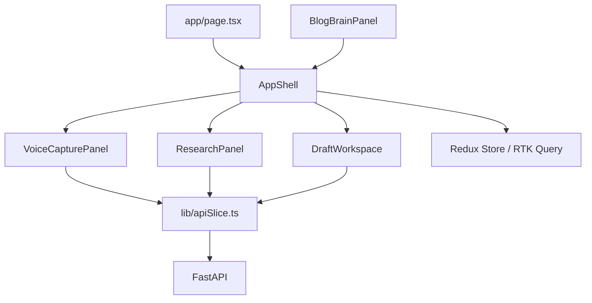

# Frontend Architecture

## Purpose

The frontend is a Next.js App Router application that provides a single voice-first writing workspace. It currently targets the seeded `demo-blog` rather than a selectable blog session.

## Application Composition

| Component | Responsibility | Behavior |
| --- | --- | --- |
| [app/page.tsx](../../frontend/app/page.tsx) | Route entry | Renders `AppShell`. |
| [components/AppShell.tsx](../../frontend/components/AppShell.tsx) | Workspace coordinator | Holds the hard-coded blog id, queries Blog Brain and research data every 30 seconds, and owns research/draft mutations. |
| [components/VoiceCapturePanel.tsx](../../frontend/components/VoiceCapturePanel.tsx) | Audio capture and upload | Uses `MediaRecorder` and `AudioContext`; rejects recordings under two seconds or 1 KB, then uploads WebM audio via the `uploadFragment` RTK Query mutation. |
| [components/BlogBrainPanel.tsx](../../frontend/components/BlogBrainPanel.tsx) | Current understanding view | Displays thesis, arguments, sentiment, intent, questions, origin labels, and contradictions. It is available as a component but is not currently rendered by `AppShell`. |
| [components/ResearchPanel.tsx](../../frontend/components/ResearchPanel.tsx) | Evidence queue | Lists claims that need evidence, lists research questions, and triggers a manual research run. |
| [components/DraftWorkspace.tsx](../../frontend/components/DraftWorkspace.tsx) | Draft interaction | Generates drafts, requests revisions, requests sentence provenance, and lists sources. The visible Publish button has no action yet. |

## Client State And Transport

[providers.tsx](../../frontend/providers.tsx) wraps the app in a `react-redux` `Provider` backed by the store created in [lib/store.ts](../../frontend/lib/store.ts). [lib/apiSlice.ts](../../frontend/lib/apiSlice.ts) defines an RTK Query `createApi` slice that is the single source of remote server state; its reducer and middleware are registered on that store.

[AppShell.tsx](../../frontend/components/AppShell.tsx) polls `/state` and `/research` every 30 seconds via `pollingInterval` on `useGetBlogStateQuery` and `useGetResearchQuery`. Cache invalidation is declarative: `runResearch` and `uploadFragment` mutations declare `invalidatesTags` for the `BlogState`/`Research` tags they affect, so dependent queries refetch automatically instead of components calling an imperative invalidate function. Draft state is held by the generation mutation's returned data, so it is not refetched from a standalone draft query.

[lib/runtime.ts](../../frontend/lib/runtime.ts) resolves the backend base URL, defaulting to `http://localhost:8001`; [lib/api.ts](../../frontend/lib/api.ts) remains the typed HTTP boundary used directly for auth (`register`, `login`, `getCurrentUser`), while [lib/apiSlice.ts](../../frontend/lib/apiSlice.ts) is the typed HTTP boundary for blog/draft/research/fragment data. JSON requests set `Content-Type: application/json`; audio uploads use `FormData` so the browser chooses the multipart boundary.

## Redux Toolkit / RTK Query Concepts

This project uses **RTK Query**, the data-fetching and caching layer built into Redux Toolkit, rather than a hand-written Redux slice with manual reducers/actions for server data. Query results are cached by endpoint name plus serialized argument, and components read that cache declaratively through generated hooks.

| Concept | Where it lives | Purpose |
| --- | --- | --- |
| `configureStore` | [lib/store.ts](../../frontend/lib/store.ts) | Combines the `api` reducer and RTK Query middleware into the single Redux store. |
| `createApi` | [lib/apiSlice.ts](../../frontend/lib/apiSlice.ts) | Declares `fetchBaseQuery`, `tagTypes`, and every query/mutation endpoint. |
| `useGetXQuery` | Generated per query endpoint | Subscribes a component to cached data for a given argument; supports `skip` and `pollingInterval`. |
| `useXMutation` | Generated per mutation endpoint | Returns a trigger function plus `{ data, isLoading, error }` local to that hook instance. |
| `providesTags` / `invalidatesTags` | Endpoint definitions in [lib/apiSlice.ts](../../frontend/lib/apiSlice.ts) | Declares which cached reads a query supplies and which a mutation should mark stale, replacing manual `invalidateQueries` calls. |
| `<Provider store={store}>` | [providers.tsx](../../frontend/providers.tsx) | Makes the Redux store (and its RTK Query cache) available to the component tree. |

## Recording To Upload

1. The writer selects **Start recording**.
2. `getUserMedia({ audio: true })` requests microphone permission.
3. `MediaRecorder` records `audio/webm;codecs=opus` when supported, otherwise `audio/webm`.
4. An `AnalyserNode` drives the visual level meter and a timer updates the elapsed seconds.
5. On stop, tracks, animation, interval, and audio context are closed. The resulting `Blob` is rejected if too small or too short.
6. `uploadFragment` posts it to `POST /blogs/demo-blog/fragments`.
7. The upload mutation's `invalidatesTags` marks the `BlogState` cache entry stale, so the Blog Brain query refetches automatically. The backend processes the fragment before responding, so this completion represents synchronous processing, not queued work.

## Draft And Research Actions

| User action | Client request | Result shown |
| --- | --- | --- |
| Run research | `POST /blogs/{blogId}/research/run` | The mutation's `invalidatesTags` marks the Research and Blog Brain caches stale, so both queries refetch. |
| Regenerate | `POST /blogs/{blogId}/draft/generate` | Latest returned draft becomes the workspace preview. |
| Apply revision | `POST /drafts/{draftId}/revise` | The input is cleared; the current implementation does not replace the shown draft with the response. |
| Inspect provenance | `GET /drafts/{draftId}/sentences/{sentenceId}/why` | Shows the interpretation and confidence response. |
| View sources | `GET /drafts/{draftId}/sources` | Lists sources associated with the draft's blog. |

## Event Streaming

[hooks/useEventStream.ts](../../frontend/hooks/useEventStream.ts) opens an `EventSource` to `/blogs/{id}/events`, parses JSON payloads, and tracks a 30-second stale threshold. The hook invocation in `AppShell` is currently commented out, so live SSE updates are not active; polling is the active refresh mechanism.

## Caveats

- `AppShell` uses the fixed `demo-blog` id. The blog creation route exists in the backend, but the UI does not expose blog selection or account-scoped sessions.
- The `BlogBrainPanel` component is implemented but not rendered by `AppShell`, so users cannot currently see the Blog Brain described by the product flow.
- The Publish button does not call an API endpoint, and there is no backend publish route.
- A successful revision clears the prompt but does not replace the currently displayed draft with the mutation response; regenerate or a refetch is needed to show it.
- `API_BASE_URL` is resolved when [lib/api.ts](../../frontend/lib/api.ts) loads, and `fetchBaseQuery`'s `baseUrl` is resolved the same way when [lib/apiSlice.ts](../../frontend/lib/apiSlice.ts) loads. Set `window.__ROBO_BLOG_API_BASE_URL__` before the client bundle imports either module; changing it later will not change the cached constant.
- The SSE hook is disabled. If enabled as written, callers should pass a stable options object/callback to avoid unnecessary `EventSource` reconnections on component re-renders.
- Browser recording requires HTTPS or `localhost` and microphone permission. The current client has no offline recording buffer or upload retry UI.