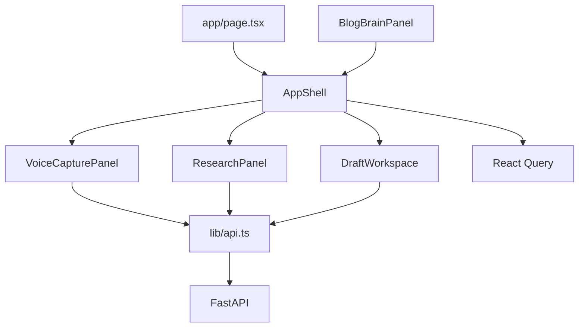

# Frontend Architecture

## Purpose

The frontend is a Next.js App Router application that provides a single voice-first writing workspace. It currently targets the seeded `demo-blog` rather than a selectable blog session.

## Application Composition

| Component | Responsibility | Behavior |
| --- | --- | --- |
| [app/page.tsx](../../frontend/app/page.tsx) | Route entry | Renders `AppShell`. |
| [components/AppShell.tsx](../../frontend/components/AppShell.tsx) | Workspace coordinator | Holds the hard-coded blog id, queries Blog Brain and research data every 30 seconds, and owns research/draft mutations. |
| [components/VoiceCapturePanel.tsx](../../frontend/components/VoiceCapturePanel.tsx) | Audio capture and upload | Uses `MediaRecorder` and `AudioContext`; rejects recordings under two seconds or 1 KB, then uploads WebM audio. |
| [components/BlogBrainPanel.tsx](../../frontend/components/BlogBrainPanel.tsx) | Current understanding view | Displays thesis, arguments, sentiment, intent, questions, origin labels, and contradictions. It is available as a component but is not currently rendered by `AppShell`. |
| [components/ResearchPanel.tsx](../../frontend/components/ResearchPanel.tsx) | Evidence queue | Lists claims that need evidence, lists research questions, and triggers a manual research run. |
| [components/DraftWorkspace.tsx](../../frontend/components/DraftWorkspace.tsx) | Draft interaction | Generates drafts, requests revisions, requests sentence provenance, and lists sources. The visible Publish button has no action yet. |

## Client State And Transport

[providers.tsx](../../frontend/providers.tsx) initializes TanStack React Query. Its default cache is fresh for 15 seconds; queries retry twice, mutations retry once, and browser focus does not automatically refetch.

[AppShell.tsx](../../frontend/components/AppShell.tsx) independently polls `/state` and `/research` every 30 seconds. It invalidates both queries after manual research and invalidates the state after an audio upload. Draft state is held by the generation mutation response, so it is not refetched from a standalone draft query.

[lib/runtime.ts](../../frontend/lib/runtime.ts) resolves the backend base URL, defaulting to `http://localhost:8001`; [lib/api.ts](../../frontend/lib/api.ts) is the typed HTTP boundary. JSON requests set `Content-Type: application/json`; audio uploads use `FormData` so the browser chooses the multipart boundary.

## TanStack Query For Redux Toolkit Developers

TanStack Query manages **remote server state**. The nearest Redux Toolkit comparison is RTK Query, not a hand-written Redux slice: query data is cached by request key, freshness and retries are configured centrally, and components request data declaratively. This project has no Redux store, reducers, actions, or client-side normalized entity cache.

| TanStack Query concept | Closest Redux Toolkit / RTK Query concept | Here |
| --- | --- | --- |
| `QueryClientProvider` | `<Provider store={store}>` plus RTK Query API setup | [providers.tsx](../../frontend/providers.tsx) creates one client for the app. |
| `useQuery({ queryKey, queryFn })` | Generated RTK Query `useGetXQuery` hook | `queryKey` identifies cached server data; `queryFn` performs the request. |
| `queryKey: ["blog-state", BLOG_ID]` | RTK Query endpoint plus serialized arguments / cache key | Every consumer of the same key reads the same cached result. |
| `staleTime: 15_000` | RTK Query cache refetch policy, though not a one-to-one setting | Data is considered fresh for 15 seconds; the shell also explicitly polls on a 30-second interval. |
| `useMutation` | Generated RTK Query `useXMutation` hook | Represents an imperative server change, with pending/error/success state local to that hook instance. |
| `invalidateQueries({ queryKey })` | `invalidatesTags` / `api.util.invalidateTags` | Marks matching cached reads stale and causes active queries to reload. |

Unlike a Redux reducer, `onSuccess` does not update a central state tree automatically. In [AppShell.tsx](../../frontend/components/AppShell.tsx), upload and research success handlers explicitly invalidate related query keys. For an optimistic interaction, use `queryClient.setQueryData` or `onMutate`/rollback behavior, conceptually similar to patching RTK Query cache data.

## Recording To Upload

1. The writer selects **Start recording**.
2. `getUserMedia({ audio: true })` requests microphone permission.
3. `MediaRecorder` records `audio/webm;codecs=opus` when supported, otherwise `audio/webm`.
4. An `AnalyserNode` drives the visual level meter and a timer updates the elapsed seconds.
5. On stop, tracks, animation, interval, and audio context are closed. The resulting `Blob` is rejected if too small or too short.
6. `uploadFragment` posts it to `POST /blogs/demo-blog/fragments`.
7. The upload completion refreshes the Blog Brain query. The backend processes the fragment before responding, so this completion represents synchronous processing, not queued work.

## Draft And Research Actions

| User action | Client request | Result shown |
| --- | --- | --- |
| Run research | `POST /blogs/{blogId}/research/run` | Research and Blog Brain query caches are invalidated. |
| Regenerate | `POST /blogs/{blogId}/draft/generate` | Latest returned draft becomes the workspace preview. |
| Apply revision | `POST /drafts/{draftId}/revise` | The input is cleared; the current implementation does not replace the shown draft with the response. |
| Inspect provenance | `GET /drafts/{draftId}/sentences/{sentenceId}/why` | Shows the interpretation and confidence response. |
| View sources | `GET /drafts/{draftId}/sources` | Lists sources associated with the draft's blog. |

## Event Streaming

[hooks/useEventStream.ts](../../frontend/hooks/useEventStream.ts) opens an `EventSource` to `/blogs/{id}/events`, parses JSON payloads, and tracks a 30-second stale threshold. The hook invocation in `AppShell` is currently commented out, so live SSE updates are not active; polling is the active refresh mechanism.

## Caveats

- `AppShell` uses the fixed `demo-blog` id. The blog creation route exists in the backend, but the UI does not expose blog selection or account-scoped sessions.
- The `BlogBrainPanel` component is implemented but not rendered by `AppShell`, so users cannot currently see the Blog Brain described by the product flow.
- The Publish button does not call an API endpoint, and there is no backend publish route.
- A successful revision clears the prompt but does not replace the currently displayed draft with the mutation response; regenerate or a refetch is needed to show it.
- `API_BASE_URL` is resolved when [lib/api.ts](../../frontend/lib/api.ts) loads. Set `window.__ROBO_BLOG_API_BASE_URL__` before the client bundle imports that module; changing it later will not change the cached constant.
- The SSE hook is disabled. If enabled as written, callers should pass a stable options object/callback to avoid unnecessary `EventSource` reconnections on component re-renders.
- Browser recording requires HTTPS or `localhost` and microphone permission. The current client has no offline recording buffer or upload retry UI.